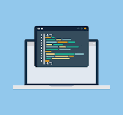
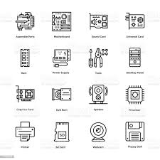
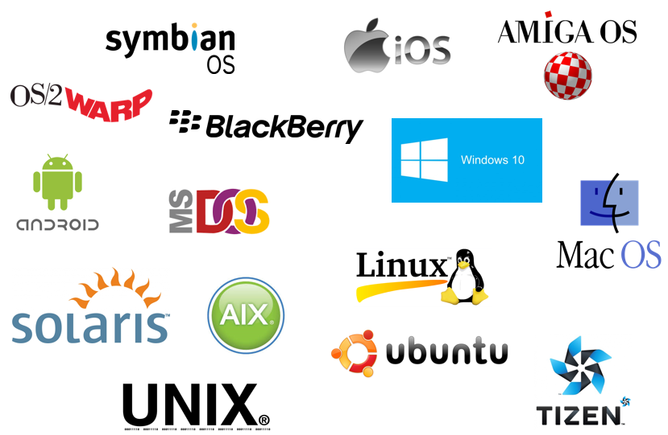
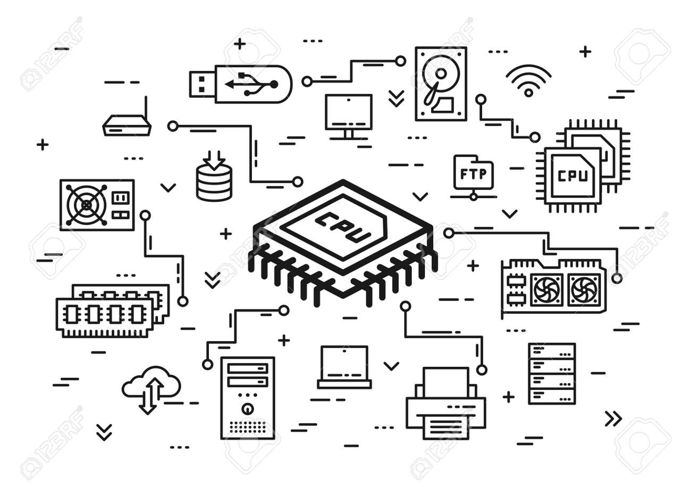
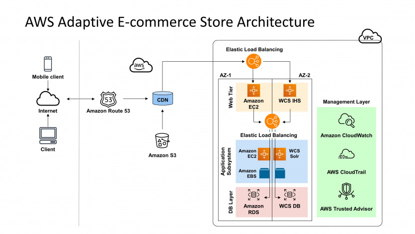

# LINUX

학습목표
---
> 아두이노와 웹 애플리케이션을 연결하는 경험을 통해 컴퓨팅 통신 구조를 이해하고, 정보 통신 기술(ICT) 분야의 직업 정보 및 경로를 탐색한다.

기본개념 소개
---
#### 프로그램이란
---
> 진행 계획이나 순서, 잘짜여진 순서의 묶음  

|-|
|-|
||

#### 소프트웨어 vs 하드웨어
---
|하드웨어|-|소프트웨어|
|:-:|-|:-:|
|부품|-|컴퓨터 프로그램|
||-||

#### 소프트웨어 종류
---

|시스템 S/W|-|APPLICATION|
|-|-|-|
|HardWare를 제어|-|사용자의목적달성|
||-| |

#### 시스템
---
> 하드웨어와 소프트웨어로 구성
> 특정 목표를 달성하기 위한 체계적인 집합

|-|
|-|
| |
|>|

#### 플랫폼
---
> 어플리케이션을 작동시키기 위한 "기반 OS"나 "기술환경"을 의미
> 시스템등이 제공되는 환경

|용어|풀이|기타|
|-|-|-|
|PC|범용 시스템|-|
|EMBEDDED|미리 정해진 특정 기능을 수행하기 위한 하드웨어와 소프트웨어가 내장된 시스템|-|
|IOT(Internet of Things|IoT는 다양한 객체나 장치들이 인터넷을 통해 서로 연결되고 상호 작용할 수 있는 컨셉|-|

#### 네트워크
---
> 여러 컴퓨터나 기타 장치들이(or 시스템) 데이터를 주고받을 수 있도록 연결된 구조를 의미 
> Keyword : 연결과 공유 

|-|
|-|
| |

#### 아키텍처란
---
> 시스템의 구조, 동작 등을 정의하는 개념적인 모형으로 시스템의 목적을 달성하기 위해 시스템의 각 컴포넌트가 무엇이며 어떻게 상호작용 하는지, 정보가 어떻게 교환되는 지를 설명 

> 제작할 목표물에 대한 설계도 

|-|
|-|
| |

